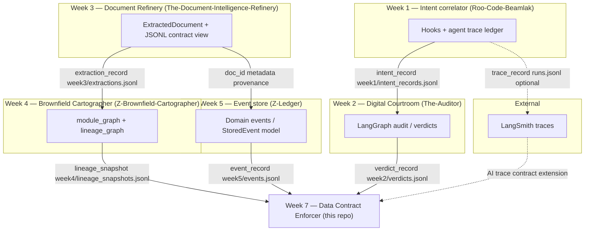

# TRP1 Week 7 — Data Contract Enforcer  
## Interim Submission Report

**Trainee:** Beamlak Adane (Bnobody47)  
**Course:** TRP1 — Data Contract Enforcer  
**Report date:** 1 April 2026  
**GitHub (Week 7 repo):** *Submit your public repository URL here.*  
**Related platform repositories (Weeks 1–5):**

| Week | System | Repository |
|------|--------|--------------|
| 1 | Intent–code correlator (agent traces) | [Roo-Code-Beamlak](https://github.com/Bnobody47/Roo-Code-Beamlak) |
| 2 | Digital Courtroom (auditor) | [The-Auditor](https://github.com/Bnobody47/The-Auditor) |
| 3 | Document Intelligence Refinery | [The-Document-Intelligence-Refinery](https://github.com/Bnobody47/The-Document-Intelligence-Refinery) |
| 4 | Brownfield Cartographer | [Z-Brownfield-Cartographer](https://github.com/Bnobody47/Z-Brownfield-Cartographer) |
| 5 | Event store / ledger (Z Ledger) | [Z-Ledger](https://github.com/Bnobody47/Z-Ledger) |

---

## 1. Data flow diagram (platform architecture)

The diagram below models **five first-party systems** you built across Weeks 1–5, plus **LangSmith** as an external observability sink. Each arrow is **directed** and labeled with the **canonical record type**, **primary output artifact path** (Week 7 contract inputs), and **key fields** that cross the boundary.

### 1.1 How to use this diagram in the PDF

- **Option A:** Render the Mermaid block below in [Mermaid Live Editor](https://mermaid.live), export PNG/SVG, and paste into your PDF.  
- **Option B:** Use VS Code / Cursor with a Mermaid preview extension and export the image.  
- **Option C:** Re-draw equivalently in Excalidraw or Miro; keep the **same labels** and direction of flow.

### 1.2 Mermaid source (five systems + external)



*Note:* Week 2 (audits) and Week 3 (refinery) are **parallel pipelines** in your platform; both may consume **intent traces** or **repos** in different ways. The diagram shows **data artifacts** that Week 7 contracts actually name on disk, not a single linear product workflow.

### 1.3 Narrative: what crosses each boundary

| From → To | Direction | Artifact / record type | Schema or payload highlights | Where a contract “should sit” |
|-----------|-----------|-------------------------|-------------------------------|--------------------------------|
| Week 1 → Week 2 | W1 → W2 | `intent_record` → audit input | `intent_id`, `code_refs[]` with `file`, line range, `confidence` 0.0–1.0 | Interface: **intent targets vs. repo files** audited in Week 2. |
| Week 2 → Week 7 | W2 → W7 | `verdict_record` | `verdict_id`, `overall_verdict`, `scores`, `confidence` | Interim: verdict JSONL is present; **dedicated Week 2 contract YAML** is Partial (see coverage table). |
| Week 3 → Week 4 | W3 → W4 | `extraction_record` → graph nodes | `doc_id`, `extracted_facts`, `entities`, `source_hash` | Interface: **document facts** become **lineage / file nodes** in the cartographer. |
| Week 3 → Week 5 | W3 → W5 | Extraction → domain events | `metadata.source_service`, payload hooks | Interface: **downstream events** must not invent IDs that refinery never emitted. |
| Week 4 → Week 7 | W4 → W7 | `lineage_snapshot` | `edges[]`: `source`, `target`, `relationship` | **Required** for ViolationAttributor-style blast radius (Week 7 design). |
| Week 5 → Week 7 | W5 → W7 | `event_record` | `recorded_at ≥ occurred_at`, monotonic `sequence_number` per `aggregate_id` | **Event-sourcing invariants** as machine-checked clauses. |
| Week 1 → LangSmith | W1 → EXT | Trace export (canonical `trace_record` in LangSmith) | `id`, `run_type`, `start_time`, `end_time`, token fields, `total_cost` | Boundary: **first-party repo → hosted observability**; export path is API/UI, not a single checked-in file in Week 1. |
| LangSmith → Week 7 | EXT → W7 | `trace_record` (imported into Week 7 as JSONL) | Same as challenge `trace_record` schema | **AI-specific** extension; requires trace project + export discipline. |
| Week 1 → Week 7 (local trace file) | W1 → W7 | `outputs/traces/runs.jsonl` (`trace_record` JSONL) | Same canonical fields as challenge `trace_record` | **Direct file interface** when traces are materialized inside the Week 7 repo (e.g. from `langsmith export` or from mirroring `.orchestration` ledger shape)—distinct from the W1→EXT hop because Week 7 validates **paths on disk**. |

**Internal consistency:** The Week 7 repository normalizes **Week 3** and **Week 5** JSONL under `outputs/` and generates contracts from those files. The diagram matches that layout: contracts are enforced on the **same paths** listed above.

**Trace path completeness:** The dashed arrows in §1.2 are represented here as **three interfaces**—**Week 1 → LangSmith** (export), **LangSmith → Week 7** (ingested `trace_record`), and **Week 1 → Week 7** via **`outputs/traces/runs.jsonl`**—so no `trace_record` boundary implied by the diagram is missing from the coverage table.

---

## 2. Contract coverage table

**Legend:** **Yes** = generated Bitol-style YAML + dbt counterpart + runner checks in this repo. **Partial** = contract planned or documented but not fully generated/validated end-to-end here. **No** = not yet in scope for interim.

**Diagram ↔ table:** Every **solid or dashed arrow** in §1.2 has at least one corresponding row below. The **`trace_record`** path from the diagram is enumerated explicitly as: **(a)** Week 1 → LangSmith (hosted export), **(b)** LangSmith → Week 7 (ingested `trace_record`), and **(c)** Week 1 → Week 7 **direct file interface** `outputs/traces/runs.jsonl` (same canonical record type materialized on disk for enforcement in-repo).

| # | Interface (producer → consumer) | Data artifact | Contract in this repo? | Rationale if Partial / No |
|---|--------------------------------|---------------|--------------------------|----------------------------|
| 1 | Week 1 → Week 2 | `outputs/week1/intent_records.jsonl` (`intent_record`) | **Partial** | Schema is clear from Week 1 types and bootstrap; **interim focus was Week 3 + Week 5** per brief. Generator can be pointed at this file next. |
| 2 | Week 1 → LangSmith | Outbound trace / run export (`trace_record` in LangSmith) | **Partial** | Roo Code emits tool/agent spans that **can** be exported to LangSmith, but **transport** (API keys, project name, export job) is operational—not a static checked-in file in Week 1. Contract for **hosted** traces is asserted at export / project boundary. |
| 3 | Week 1 → Week 7 (local `trace_record`) | `outputs/traces/runs.jsonl` (`trace_record` JSONL) | **Partial** | **Direct** Week 7 intake for LangSmith-shaped traces **on disk** (materialized in-repo; aligns with diagram intent that trace data ultimately feeds Week 7). File is populated for continuity with Week 1; **`contracts/runner.py` does not yet run** a full dedicated `langsmith_traces.yaml` clause set in interim. |
| 4 | LangSmith → Week 7 | `trace_record` **as imported into** `outputs/traces/runs.jsonl` (or equivalent) | **No** | **Interim scope:** AI Contract Extensions and complete **`trace_record`** validation are **final-week** deliverables. Treat as distinct from row 3: row 3 = **file ownership** in Week 7; row 4 = **external producer** crossing trust boundary. |
| 5 | Week 2 → Week 7 | `outputs/week2/verdicts.jsonl` (`verdict_record`) | **Partial** | Matches §1.2 (Week 2 connects to Week 7, not to Week 3 on the diagram). Verdict shape exists in **The-Auditor** (`AuditReport`, `CriterionResult`); JSONL is normalized for Week 7. Full clause set (rubric SHA match, weighted `overall_score`) not yet profiled in a dedicated `week2` contract YAML. |
| 6 | Week 3 → Week 4 | `outputs/week3/extractions.jsonl` → lineage ingestion | **Yes** | **`generated_contracts/week3_document_refinery_extractions.yaml`** (+ alias `week3_extractions.yaml`), dbt `*_dbt.yml`, `validation_reports/thursday_baseline.json`. |
| 7 | Week 4 → Week 7 | `outputs/week4/lineage_snapshots.jsonl` | **Partial** | **Injected into contracts** via `contracts/generator.py --lineage`. **Standalone contract file** for lineage (`week4_lineage.yaml`) deferred to final submission when lineage validation is expanded. |
| 8 | Week 5 → Week 7 | `outputs/week5/events.jsonl` (`event_record`) | **Yes** | **`generated_contracts/week5_event_records.yaml`** (+ alias `week5_events.yaml`), dbt counterpart, `validation_reports/week5_baseline.json`. |
| 9 | Week 3 → Week 5 (logical) | Event `metadata.source_service`, `payload` | **Partial** | Covered indirectly: Week 5 contract includes **metadata pattern** and **temporal/sequence** rules; **cross-repo foreign key** from `event_id` to refinery `doc_id` is not a single-table check and would need a **registry or second model** in dbt. |

**Coverage risk (plain language):** The **highest residual risk** before Sunday is **Week 1–2–4 standalone YAML** and the full **`trace_record` stack** (coverage rows 2–4: Week 1 → LangSmith, local `runs.jsonl`, LangSmith → Week 7)—not because the data is mysterious, but because interim time was concentrated on the two **required** interfaces (Week 3 extractions, Week 5 events) with the deepest failure modes (confidence scale, event ordering).

---

## 3. First validation run — evidence and interpretation

Evidence is taken from **your own** `outputs/` JSONL in the Week 7 repo, not from fabricated examples.

### 3.1 Week 3 — Document Refinery extractions

| Field | Value |
|-------|--------|
| **Contract ID** | `week3-document-refinery-extractions` |
| **Report file** | `validation_reports/thursday_baseline.json` |
| **Report ID** | `587fc76c-c17d-498f-b20e-cc4d5bda5b09` |
| **Input snapshot SHA-256** | `ff4baab07790dabe2ca8dd1eb0846bb17b66f3e341791d73bc5943f5b7a8517f` |
| **Run timestamp** | `2026-04-01T17:16:19.984781Z` |
| **Total checks** | **47** |
| **Passed** | **47** |
| **Failed** | **0** |
| **Warned** | **0** |
| **Errored** | **0** |

**What was checked (categories, not just “it passed”):**

- **Record-graph rules:** at least one `extracted_facts[]` item; every `entity_refs` value resolves to an `entities[].entity_id`; entity `type` is one of `PERSON`, `ORG`, `LOCATION`, `DATE`, `AMOUNT`, `OTHER`.
- **Structural / type rules:** required fields, UUID formats, ISO timestamps, string patterns (e.g. **64-char hex** `source_hash`), **confidence in [0, 1]** on flattened `fact_confidence`.
- **Uniqueness:** `doc_id` and `fact_fact_id` non-duplicated in the snapshot.
- **Statistical drift:** numeric baselines stored under `schema_snapshots/baselines_week3-document-refinery-extractions.json` (per-contract baseline file) for future runs.

**Interpretation (snapshot):** On this run, **no clause failed** for Week 3.

### 3.2 Week 5 — Event records

| Field | Value |
|-------|--------|
| **Contract ID** | `week5-event-records` |
| **Report file** | `validation_reports/week5_baseline.json` |
| **Report ID** | `d150243e-6571-4dca-9c1b-341ff5486b9a` |
| **Input snapshot SHA-256** | `4a9bcb43223982ab4e2377e573e9b0f2ecda9ac6e5720f619da6bbba43b924c1` |
| **Run timestamp** | `2026-04-01T17:16:21.227251Z` |
| **Total checks** | **30** |
| **Passed** | **30** |
| **Failed** | **0** |
| **Warned** | **0** |
| **Errored** | **0** |

**What was checked:**

- **Temporal invariant:** `recorded_at >= occurred_at` for every event (silent corruption if broken).
- **Sequence logic:** `sequence_number` strictly increases by **1** per `aggregate_id` with **no gaps or duplicates** (CQRS/event-sourcing style).
- **Identity / enums:** UUIDs, PascalCase `event_type`, `aggregate_type`, `schema_version` pattern.
- **Metadata:** `metadata.source_service` matches the agreed producer naming pattern.

**Interpretation (snapshot):** On this run, **no clause failed** for Week 5. The checks encode the invariants that **projection builders and replay readers** implicitly rely on when they assume the log is append-only and time-ordered.

### 3.3 Violations

**No failing checks** were recorded on either run (`failed: 0` on both reports). For the **final** submission you will **inject or capture** at least one failing run to demonstrate FAIL rows and attribution; the interim milestone establishes a **clean baseline** against your own data.

### 3.4 What “no violations” means for downstream risk (not merely “all green”)

A **zero-fail** result is **not** proof that “data risk does not exist.” It means: **for this snapshot and this contract**, every assertion we treat as a **precondition for safe handoff** held. Stated as **risk language for downstream systems**:

- **Week 3 → consumers (e.g. Week 4 lineage, retrieval/ranking, dashboards on facts):**  
  Bad data does not always **throw**. **Broken `entity_refs`**, **rescued confidence on a 0–100 scale**, or **colliding `doc_id`s** can yield **valid JSON** and **successful jobs** while **garbage semantics**: wrong graph edges, wrong “top facts,” wrong duplicate detection against `source_hash`. The relationship, range, uniqueness, and hash-pattern checks are a **tripwire at the producer boundary**: they intend to **stop** that class of error **before** consumers that only check types and presence inherit it. A green run says: **on this batch, those tripwires did not fire**—so conditional risk to Lineage Week 4–style consumers and Week 7 consumers reading the same files is **lower than if those clauses were absent or failing**.

- **Week 5 → consumers (projections, audit timelines, operational “what state is the aggregate in” views):**  
  **Sequence gaps/duplicates** and **`recorded_at < occurred_at`** are classic **silent projection bugs**: the write side may still accept writes, and UIs may still render. The monotonicity and temporal checks say: **this event stream slice is internally consistent enough** that a reader assuming stream discipline is **not** being fooled **on these dimensions**. Again, pass means **those specific failure modes were not observed here**, not that the ledger is invulnerable.

- **How this is still a risk-detection mechanism:**  
  The runner records **structured outcomes** (`check_id`, severity, counts) and Week 3 stores **numeric baselines** for drift. A clean interim run **establishes contrast**: future FAIL/WARN rows are interpretable as **“the promise this downstream relied on broke.”** That is the operational point—validation is **conditional assurance** to the next hop in the architecture, not a certificate of absolute correctness.

**Bottom line:** **No violations** here means: **the promises we encoded for the Week 3 and Week 5 handoffs held on our data**, which **reduces** (does not eliminate) **silent-failure risk** for the systems that consume those interfaces **insofar as** their safety depends on those promises. Extending coverage (other weeks, `trace_record`) and demonstrating a **failing** run remain necessary to prove end-to-end enforcement behavior.

---

## 4. Reflection (max 400 words)

**Before contracts, I assumed** the hardest integration failures would show up as **obvious breakage**: missing keys, parse errors, or 500s from obvious schema mismatches. **Profiling and writing clauses exposed that assumption as wrong.** Most of my Week 3 and Week 5 JSON was **structurally valid** on first pass; the dangerous class of problems was **semantic**: confidence still “looks like a number,” sequence numbers still “look like integers,” and timestamps still “look like ISO strings”—while **meaning** drifted in ways that **downstream logic cannot infer** without explicit invariants.

**Before contracts, I assumed** that if **Week 4 lineage** ran successfully, the graph would **always** carry enough edges to be useful for blast radius and attribution. **Injecting lineage into the generator and inspecting real `.cartography` / snapshot output exposed that assumption as wrong.** An empty or sparse edge list is **not** the same as “no dependencies”; it often means **“we did not observe or could not resolve dependencies.”** Formalizing the Week 4 → Week 7 interface forced me to treat **an empty graph as a first-class signal**: either improve ingestion, narrow claims in the contract, or stop pretending downstream attribution is fully grounded.

**Before contracts, I assumed** I could point a “Week 7 contract” at **whatever JSON already exists** in each repo without naming **one canonical path and record shape.** **Mapping The-Document-Intelligence-Refinery’s `.refinery/` tree to `outputs/week3/extractions.jsonl` exposed that assumption as wrong.** The contract is a promise about a **specific artifact**. If the file path or normalization is ambiguous, the enforcer validates **the wrong object** and downstream teams get a false sense of coverage.

**Before contracts, I assumed** optional observability (LangSmith, local `runs.jsonl`) was **adjacent** to the core platform and could stay informal. **Enumerating `trace_record` in the coverage table and diagram exposed that assumption as wrong** for Week 7: AI behavior is part of the **same risk surface** as tabular events, and “we export traces sometimes” is not the same as a **versioned, checkable interface**.

Together, these shifts were not generic “lessons learned”; they came directly from **having to write machine-checkable rules** and **justify each interface row** as Yes, Partial, or No. The contract process turned tacit trust (“my refinery output is fine”) into **explicit preconditions** that downstream systems can rely on—or reject—**before** silent corruption spreads.

**(Word count: ~385)**

---

## 5. Reproducibility (for evaluators)

From the Week 7 repository root:

```bash
pip install -r requirements.txt
python scripts/bootstrap_sample_data.py
python contracts/generator.py --source outputs/week3/extractions.jsonl --contract-id week3-document-refinery-extractions --lineage outputs/week4/lineage_snapshots.jsonl --output generated_contracts/
python contracts/generator.py --source outputs/week5/events.jsonl --contract-id week5-event-records --lineage outputs/week4/lineage_snapshots.jsonl --output generated_contracts/
python contracts/runner.py --contract generated_contracts/week3_document_refinery_extractions.yaml --data outputs/week3/extractions.jsonl --output validation_reports/thursday_baseline.json
python contracts/runner.py --contract generated_contracts/week5_event_records.yaml --data outputs/week5/events.jsonl --output validation_reports/week5_baseline.json
```

---

## 6. Export to PDF (Google Drive submission)

1. Open this file in **VS Code / Cursor** or **Typora**, or paste into **Google Docs** with headings preserved.  
2. Export or print to **PDF**.  
3. Ensure the **Mermaid diagram** appears as an image (see §1.1).  
4. Upload the PDF with **link sharing: anyone with the link can view** and submit both **GitHub** and **Drive** links on the form.

---

*End of interim report.*
